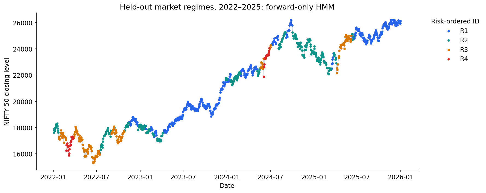
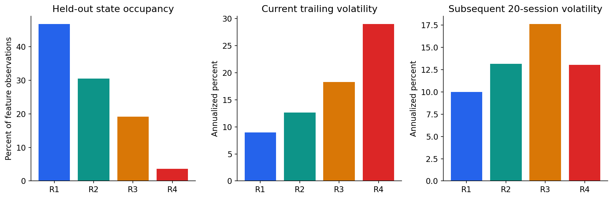

# Market Regime Detection: Indian Equity Markets

A reproducible time-series project comparing **risk/trend rules, K-means, and Gaussian Hidden Markov Models** on NIFTY 50 and India VIX. NIFTY BANK adds a market-correlation diagnostic. The project uses chronological selection and explicit forward filtering for held-out state assignments.

## Questions

- Which market feature distributions describe different volatility and trend environments?
- Does temporal modelling provide a more persistent description than independent clustering?
- Can the model be evaluated without using future observations to assign earlier states?
- How sensitive are assignments to initialization?
- Do current state descriptions have similar patterns in subsequent observed volatility?

## Measured results

| Measure | Result |
|---|---:|
| Valid feature observations, 2011–2025 | 3,717 |
| Initial training observations, 2011–2018 | 1,981 |
| Validation observations, 2019–2021 | 745 |
| Held-out observations, 2022–2025 | 991 |
| Selected HMM states | 4 |
| Selected K-means clusters | 3 |
| Held-out HMM hard-label switch rate | 4.04% |
| Held-out K-means hard-label switch rate | 11.01% |
| Held-out rule hard-label switch rate | 10.71% |
| HMM mean held-out conditional log score | -3.517 |
| Independent Gaussian mixture mean held-out log score | -4.521 |
| Median test-assignment ARI across initialization fits | 0.742 |
| Filtered versus smoothed test-label disagreement | 6.05% |

Log scores are nats per observation in the same fixed standardized feature space; higher values are better. The HMM uses a transition model and more parameters than the independent mixture. The density comparison measures the fitted feature distribution, not profitable price prediction.

Fewer label switches indicate a smoother description, not proof of more accurate regimes. Initialization sensitivity remains material. The high current-volatility state R4 had mean subsequent 20-session volatility of **13.1%**, lower than R3's **17.6%**. Current stress-like conditions therefore did not imply monotonically higher subsequent risk in this sample. R4 has only 36 held-out observations, and future windows overlap.





## Quick start

Python **3.11+**; tested with Python 3.12. Run from the repository root.

```bash
python -m venv .venv
# macOS / Linux:
source .venv/bin/activate
# Windows PowerShell instead: .venv\Scripts\Activate.ps1
python -m pip install -r requirements.txt
python scripts/run_analysis.py
python -m pytest -q
```

The downloadable ZIP includes `data/input/market_prices.csv`, so a full run does not need website downloads. Input files are deliberately excluded from Git. If cloning the Git bundle or GitHub repository, place a compatible local CSV at that path; source and schema instructions are in [data/README.md](data/README.md).

### Notebook and reading copy

Open [notebooks/market_regime_detection.ipynb](notebooks/market_regime_detection.ipynb) in VS Code or Jupyter. Keep the notebook inside the extracted repository because it imports the tested Python modules and reads the local data file.

```bash
python -m pip install jupyterlab
jupyter lab notebooks/market_regime_detection.ipynb
```

The notebook includes executed outputs, filtering equations, model comparisons, seven figures, and discussion of limitations. [notebooks/market_regime_detection.html](notebooks/market_regime_detection.html) is a reading copy that does not require Python.

To execute and export automatically:

```bash
python scripts/execute_notebook.py
```

For environments that prohibit kernel sockets:

```bash
python scripts/execute_notebook.py --in-process
```

### Score with the saved model

```bash
python scripts/score_prices.py data/input/market_prices.csv data/processed/scored_quotes.csv
```

The artifact includes the final fitted model, scaler, state mapping, and last fitting-period posterior. Input must contain feature-warmup history and the complete valid post-fit sequence starting at the expected next observation, 3 January 2022. The command continues filtering without refitting. It is an offline scoring interface; much later market data requires renewed validation.

## Chronological design

| Period | Role |
|---|---|
| 2011–2018 | Initial scaler and model fitting |
| 2019–2021 | Three-versus-four-state configuration selection |
| 2011–2021 | Refit selected configurations and freeze parameters |
| 2022–2025 | Held-out evaluation |

For each HMM state count, run five initialization seeds. Select an adequately completed fit using training likelihood, then compare candidate counts using conditional validation log score. For the final refit, select the initialization using fitting-period likelihood. Test likelihood is reported for all refit seeds as a sensitivity diagnostic and is not used to change the final choice.

The rule volatility threshold is calibrated using initial training observations. K-means selects three or four clusters by validation silhouette with minimum cluster-size checks, then refits before testing.

## Features and state definitions

| Column | Definition | Role |
|---|---|---|
| `nifty_log_return` | Log change in NIFTY closing level | Model input |
| `log_volatility_20` | Log of trailing 20-observation return standard deviation, annualized by square root of 252 | Model input |
| `momentum_20` | Log of current NIFTY close divided by its close 20 observations earlier | Model input |
| `log_vix` | Log of India VIX close | Model input |
| `nifty_bank_correlation_20` | Trailing correlation of NIFTY and BANK log returns | Profile diagnostic |
| `drawdown` | Current close divided by its running historical maximum, minus one | Profile diagnostic |

The HMM has diagonal Gaussian emissions. State IDs R1–R4 are ordered by their fitting-period average trailing volatility. Their profiles span lower-volatility positive-trend conditions, moderate and elevated volatility, and a high-volatility stress-like environment. They are statistical descriptions rather than externally verified economic labels.

Features are available only **after the current day's close**. An earlier decision must lag them. Filtering estimates the state using observations through the current date. Full-sequence `predict_proba` and Viterbi decoding can use future observations and are not used for the held-out operational assignments.

The fitted probability calculation is independently implemented as a forward recursion in log space. Tests compare its total likelihood with the library likelihood, check continuation across splits, and verify that future observations cannot change a previous filtered posterior.

## Repository layout

| Path | Contents |
|---|---|
| `src/market_regimes/` | Quote validation, features, baselines, HMM filtering, selection, evaluation, reporting and pipeline |
| `scripts/run_analysis.py` | Full reproducible workflow |
| `scripts/score_prices.py` | Frozen-model sequence scoring |
| `notebooks/` | Executed explanation and HTML reading copy |
| `results/` | Selection tables, state profiles, transitions, likelihood, sensitivity, provenance and figures |
| `artifacts/regime_hmm.joblib` | Model, scaler, state mapping and continuation posterior |
| `data/input/` | Local price input; supplied in ZIP, excluded from Git |
| `data/processed/` | Local daily assignments and scoring outputs; excluded from Git |
| `tests/` | Feature timing, forward filtering, sequence likelihood, continuation and artifact checks |
| `docs/project_walkthrough.md` | Conceptual explanation and interview discussion |
| `docs/publishing.md` | Publishing the existing history to an empty GitHub repository |

## Data coverage and limitations

The input is a local aligned extract attributed by its supplied coverage notes to official NSE/NIFTY sources. The extract is checked for schema, positive values and duplicate dates; original exchange downloads are not independently redownloaded. Its SHA-256 is recorded in `results/data_manifest.json`.

There are 1 incomplete feature observation(s) inside the 2011–2025 analysis period: 2024-03-02. Missing observations are not filled. HMM transitions and duration estimates therefore refer to consecutive valid feature observations, not calendar days.

- No authoritative labelled regimes exist; no supervised classification accuracy is reported.
- Gaussian emissions approximate heavy-tailed returns. Diagonal covariance approximates dependencies between features.
- Rolling features overlap, which contributes serial dependence and persistence. Smoother HMM labels are not independent proof of economic-state stability.
- The state-count search is bounded to three and four, not an exhaustive search for a true number of market states.
- Initialization changes can affect fitted partitions. Membership probabilities are model-based and not externally calibrated certainty.
- Fit-period charts/profiles are retrospective. Genuine held-out evaluation begins in 2022.
- Future 20-session outcomes are separate diagnostics; overlapping windows and rare-state samples preclude naive independent-observation significance claims.
- Parameters remain frozen through 2021. Structural changes after that date may require retraining or another model.
- No investable portfolio, execution rule, transaction costs or economic profit is evaluated.

## References

- NIFTY Indices historical data: https://www.niftyindices.com/reports/historical-data
- NSE India VIX historical data: https://www.nseindia.com/reports-indices-historical-vix
- hmmlearn tutorial: https://hmmlearn.readthedocs.io/en/stable/tutorial.html
- hmmlearn decoding and probability API: https://hmmlearn.readthedocs.io/en/stable/api.html

Code is MIT licensed. No separate price-data redistribution license is asserted.
